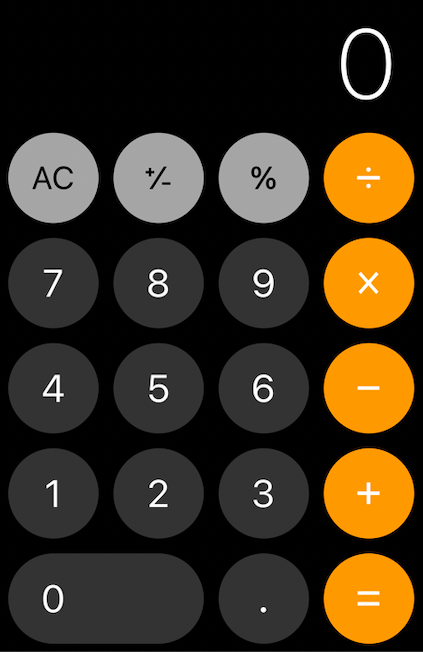
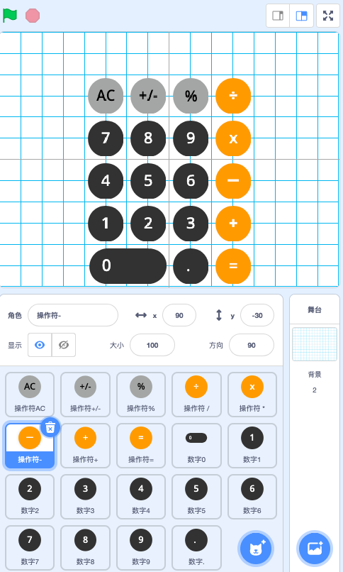
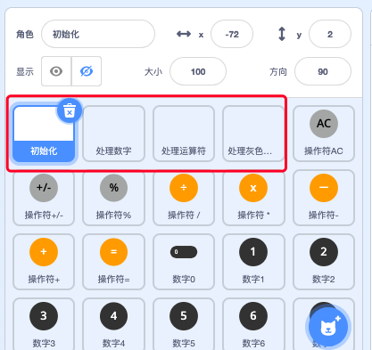

# scratch_calculator

use scratch make a calculator.

用 scratch 制作了一个简易的计算器，功能模仿 iphone 自带的计算器

### 需求分析

### 概要设计

整个项目拆分成三大部分

- UI 交互
- 处理用户输入和运算
- 显示(输出)运算结果

### 详细设计

#### UI 设计

- 舞台背景为纯黑色
- 按钮分为 3 种颜色, 两个形状
- 颜色可以通过吸管取得

#### 绘画

这里就不赘述了, 主要就是画圆和方

#### 布局

- 舞台的 0,0 坐标在舞台的正中心
- 整个按钮的布局的中心，在 8956 的中心
- 圆圈按钮的直径是 50, 基准点是圆心
- 按钮的间隔是 10
- 计算出 9 6 5 8 的坐标
  - 9: 30,30
  - 6: 30,/-30
  - 5: /-30, /-30
  - 8: /-30, 30
- 辅助格子的大小是 30, 所以舞台的布宽 240, 高 360

#### 为按钮绑定事件

- 每个可见按钮的**_角色_**都不处理任何业务逻辑，按钮只广播自己被点击的事件，事件名称就是自己本身
- 这样的好处就是，按钮角色的代码，只用编写一次，以后就不用管了

#### 业务逻辑和 UI 分离

这样的好处，就是在复用 UI 和业务逻辑的时候,可以分开导出导入.

#### 拆分业务逻辑

- 处理输入数字
- 处理输入橘黄色的运算符
- 处理输入橘灰色色的运算符

#### 内部实现

拆封成 3 部分

- 输入
- 处理输入
- 输出

输入:分为两大类，数字 和 操作符

处理输入: 一般做数学运算的加法, 第一个数字被称为被加数，中间的加就是运算符，第三个是加数。  
这里抽象成 被操作数 运算符 操作数, 运算结果放在被操作数里

输出:
